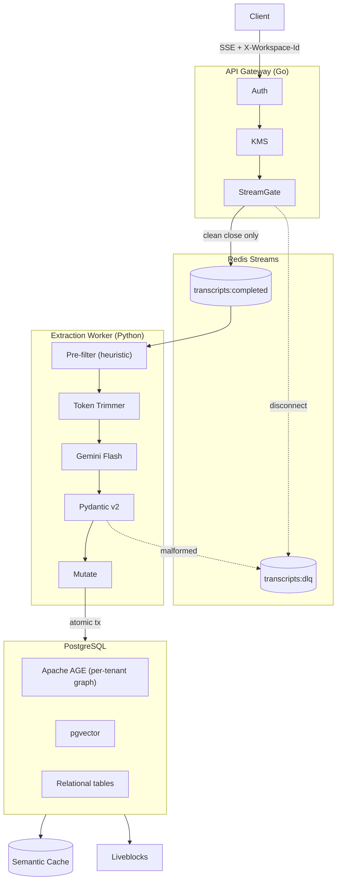

# Implementation Plan: AI Gateway Proxy & Graph Extraction Pipeline — v2

**Project**: Collaborative AI Context Synchronization Platform  
**Reference**: [project-researchv2.md](file:///c:/Users/KIIT/Documents/SYNC%20TOOL/project-researchv2.md)  
**Supersedes**: v1 (14 issues fixed; token minimization pipeline added)

---

## 1. Architecture Overview



---

## 2. Technology Stack

| Subsystem | Choice | Why |
|---|---|---|
| Proxy | Go (`net/http` + Chi) | Zero-alloc stream pipe, explicit byte wipe |
| KMS | Cloud KMS / HashiCorp Vault | Envelope encryption, KEK never leaves KMS |
| Queue | Redis Streams (`XADD`/`XREADGROUP`) | Consumer groups, DLQ, shares existing Redis |
| Worker | Python asyncio | Pydantic v2, google-genai SDK, psycopg3 |
| Extraction | Gemini Flash (structured output) | Native JSON Schema enforcement, cheap tokens |
| Storage | PostgreSQL 16 + Apache AGE + pgvector | Single transaction boundary |

---

## 3. Data Contracts & Schema

### 3.1 Relational Schema (`org_<tenant_id>`)

```sql
CREATE TABLE workspaces (
    id          UUID PRIMARY KEY DEFAULT gen_random_uuid(),
    name        VARCHAR(255) NOT NULL,
    created_at  TIMESTAMPTZ DEFAULT NOW(),
    updated_at  TIMESTAMPTZ DEFAULT NOW()
);

CREATE TABLE branches (
    id               UUID PRIMARY KEY DEFAULT gen_random_uuid(),
    workspace_id     UUID NOT NULL REFERENCES workspaces(id) ON DELETE CASCADE,
    name             VARCHAR(100) NOT NULL DEFAULT 'main',
    mutation_version BIGINT NOT NULL DEFAULT 1,
    is_active        BOOLEAN NOT NULL DEFAULT TRUE,
    created_at       TIMESTAMPTZ DEFAULT NOW(),
    updated_at       TIMESTAMPTZ DEFAULT NOW(),
    UNIQUE(workspace_id, name)
);

-- Envelope-encrypted provider keys
-- FIX #13: key rotation MUST regenerate both encrypted_key AND key_nonce atomically
CREATE TABLE workspace_provider_keys (
    id            UUID PRIMARY KEY DEFAULT gen_random_uuid(),
    workspace_id  UUID NOT NULL REFERENCES workspaces(id) ON DELETE CASCADE,
    provider      VARCHAR(50) NOT NULL,   -- 'openai' | 'anthropic' | 'gemini'
    encrypted_dek BYTEA NOT NULL,         -- DEK wrapped by Cloud KMS KEK
    encrypted_key BYTEA NOT NULL,         -- Provider key encrypted by DEK (AES-256-GCM)
    key_nonce     BYTEA NOT NULL,         -- 12-byte GCM nonce; regenerated on rotation
    key_hash      VARCHAR(64) NOT NULL,   -- SHA-256 fingerprint
    created_by    UUID NOT NULL,
    created_at    TIMESTAMPTZ DEFAULT NOW(),
    updated_at    TIMESTAMPTZ DEFAULT NOW(),
    UNIQUE(workspace_id, provider)
);

-- Transcripts: raw_payload is stripped after confirmed extraction (FIX #7)
-- Stored encrypted (same DEK as provider keys) to protect PII / trade secrets
CREATE TABLE transcripts (
    id               UUID PRIMARY KEY DEFAULT gen_random_uuid(),
    workspace_id     UUID NOT NULL REFERENCES workspaces(id) ON DELETE CASCADE,
    branch_id        UUID NOT NULL REFERENCES branches(id) ON DELETE CASCADE,
    actor_id         UUID NOT NULL,
    provider         VARCHAR(50) NOT NULL,
    model            VARCHAR(100) NOT NULL,
    stream_status    VARCHAR(20) NOT NULL,  -- 'completed' | 'interrupted' | 'error'
    prompt_tokens    INT DEFAULT 0,
    completion_tokens INT DEFAULT 0,
    raw_payload      BYTEA,                 -- AES-256-GCM encrypted JSONB; NULLed post-extraction
    extraction_done  BOOLEAN NOT NULL DEFAULT FALSE,
    created_at       TIMESTAMPTZ DEFAULT NOW()
);

-- FIX #14: context_commits audit table (was referenced but missing)
CREATE TABLE context_commits (
    id               UUID PRIMARY KEY DEFAULT gen_random_uuid(),
    workspace_id     UUID NOT NULL REFERENCES workspaces(id) ON DELETE CASCADE,
    branch_id        UUID NOT NULL REFERENCES branches(id) ON DELETE CASCADE,
    transcript_id    UUID NOT NULL REFERENCES transcripts(id),
    mutation_version BIGINT NOT NULL,        -- post-commit version
    nodes_written    INT NOT NULL DEFAULT 0,
    edges_written    INT NOT NULL DEFAULT 0,
    created_at       TIMESTAMPTZ DEFAULT NOW()
);

-- FIX #11: committed to text-embedding-3-small (1536 dims)
-- Switching models requires full re-embedding + REINDEX CONCURRENTLY
CREATE EXTENSION IF NOT EXISTS vector;
CREATE TABLE entity_embeddings (
    id            UUID PRIMARY KEY DEFAULT gen_random_uuid(),
    workspace_id  UUID NOT NULL REFERENCES workspaces(id) ON DELETE CASCADE,
    branch_id     UUID NOT NULL REFERENCES branches(id) ON DELETE CASCADE,
    graph_node_id VARCHAR(255) NOT NULL,
    node_type     VARCHAR(50) NOT NULL,
    name          VARCHAR(255) NOT NULL,
    description   TEXT NOT NULL,
    embedding     vector(1536) NOT NULL,   -- text-embedding-3-small ONLY
    mutation_version BIGINT NOT NULL,
    created_at    TIMESTAMPTZ DEFAULT NOW(),
    updated_at    TIMESTAMPTZ DEFAULT NOW(),
    UNIQUE(branch_id, graph_node_id)
);

CREATE INDEX idx_ee_knn ON entity_embeddings
    USING hnsw (embedding vector_cosine_ops) WITH (m = 16, ef_construction = 64);
CREATE INDEX idx_ee_lookup ON entity_embeddings(workspace_id, branch_id, mutation_version);
```

### 3.2 Apache AGE — Per-Tenant Graph (FIX #6)

```sql
CREATE EXTENSION IF NOT EXISTS age;
LOAD 'age';
SET search_path = ag_catalog, "$user", public;

-- Graph name is scoped per org to enforce tenant isolation
-- Pattern: workspace_graph_<org_id>  (org_id = short UUID hex, no hyphens)
SELECT create_graph('workspace_graph_<org_id>');

-- Vertex labels: Component | Decision | Constraint | Task
-- All vertices carry: {id, name, summary, branch_id, confidence, updated_at}
-- Edge labels: DEPENDS_ON | MODIFIES | CONSTRAINED_BY | DECIDED_IN | BLOCKS
-- All edges carry: {branch_id, created_at}
```

### 3.3 Redis Stream Event

```json
{
  "idempotency_key": "<workspace_id>:<branch_id>:<completed_at_ms>",
  "workspace_id": "...",
  "branch_id": "...",
  "transcript_id": "...",
  "actor_id": "...",
  "provider": "openai",
  "model": "gpt-4o",
  "turns": [
    {"role": "user", "content": "..."},
    {"role": "assistant", "content": "..."}
  ],
  "usage": {"prompt_tokens": 128, "completion_tokens": 42},
  "completed_at_ms": 1727800800000
}
```

> Note: `system` messages are stripped before enqueue (token saving; not useful for extraction).

### 3.4 Pydantic Extraction Schema

```python
from enum import Enum
from typing import List, Optional
from pydantic import BaseModel, Field

class NodeType(str, Enum):
    COMPONENT  = "Component"
    DECISION   = "Decision"
    CONSTRAINT = "Constraint"
    TASK       = "Task"

class EdgeType(str, Enum):
    DEPENDS_ON      = "DEPENDS_ON"
    MODIFIES        = "MODIFIES"
    CONSTRAINED_BY  = "CONSTRAINED_BY"
    DECIDED_IN      = "DECIDED_IN"
    BLOCKS          = "BLOCKS"

class ExtractedNode(BaseModel):
    id:         str       = Field(description="Slug: lowercase alphanumeric + hyphens, max 128 chars")
    name:       str
    node_type:  NodeType
    summary:    str       = Field(description="≤ 2 sentences")
    confidence: float     = Field(ge=0.0, le=1.0)

class ExtractedEdge(BaseModel):
    source_id: str
    target_id: str
    edge_type: EdgeType

class ContextExtractionResult(BaseModel):
    has_meaningful_context: bool
    nodes: List[ExtractedNode] = []
    edges: List[ExtractedEdge] = []
```

> `properties` dict removed from `ExtractedNode` — it was untyped and added tokens without contributing to graph queries. `context` removed from `ExtractedEdge` for same reason.

---

## 4. Subsystem Implementations

### 4.1 Go API Gateway & SSE Proxy

#### Provider Router (FIX #8, #9)

```go
// internal/proxy/router.go
type ProviderConfig struct {
    BaseURL        string
    FinishDetector func(chunk []byte) bool
}

var providers = map[string]ProviderConfig{
    "openai": {
        BaseURL:        "https://api.openai.com",
        FinishDetector: func(b []byte) bool { return bytes.Contains(b, []byte("data: [DONE]")) },
    },
    "anthropic": {
        BaseURL:        "https://api.anthropic.com",
        FinishDetector: func(b []byte) bool { return bytes.Contains(b, []byte(`"type":"message_stop"`)) },
    },
    "gemini": {
        BaseURL:        "https://generativelanguage.googleapis.com",
        FinishDetector: func(b []byte) bool { return bytes.Contains(b, []byte(`"finishReason":"STOP"`)) },
    },
}
```

#### Stream Handler (FIX #2, #4, #10)

```go
// internal/proxy/handler.go
func (h *ProxyHandler) ServeHTTP(w http.ResponseWriter, r *http.Request) {
    ctx := r.Context()
    workspaceID := r.Header.Get("X-Workspace-Id")
    providerID  := r.Header.Get("X-Provider")   // "openai" | "anthropic" | "gemini"
    branchID    := r.Header.Get("X-Branch-Id")
    if workspaceID == "" || providerID == "" {
        http.Error(w, "missing required headers", http.StatusBadRequest)
        return
    }

    prov, ok := providers[providerID]
    if !ok {
        http.Error(w, "unsupported provider", http.StatusBadRequest)
        return
    }

    apiKey, err := h.resolveWorkspaceKey(ctx, workspaceID, providerID)
    if err != nil {
        http.Error(w, "key resolution failed", http.StatusUnauthorized)
        return
    }
    defer wipeBytes(apiKey)

    upstreamURL := prov.BaseURL + r.URL.Path
    upstreamReq, _ := http.NewRequestWithContext(ctx, r.Method, upstreamURL, r.Body)
    upstreamReq.Header = sanitizeHeaders(r.Header.Clone())
    upstreamReq.Header.Set("Authorization", "Bearer "+string(apiKey))

    resp, err := h.httpClient.Do(upstreamReq)
    if err != nil {
        http.Error(w, "upstream error", http.StatusBadGateway)
        return
    }
    defer resp.Body.Close()

    for k, v := range resp.Header { w.Header()[k] = v }
    w.WriteHeader(resp.StatusCode)
    flusher := w.(http.Flusher)

    var buf bytes.Buffer
    scratch := make([]byte, 4096)
    isClean := false

outerLoop: // FIX #2: labeled break exits the for, not just the select
    for {
        select {
        case <-ctx.Done():
            logInterrupted(workspaceID, branchID)
            return
        default:
            n, err := resp.Body.Read(scratch)
            if n > 0 {
                chunk := scratch[:n]
                buf.Write(chunk)
                w.Write(chunk)
                flusher.Flush()
                if prov.FinishDetector(chunk) {
                    isClean = true
                }
            }
            if err != nil {
                break outerLoop  // EOF or error: exit cleanly
            }
        }
    }

    if !isClean {
        return
    }

    // FIX #10: deterministic idempotency key prevents duplicate enqueue
    idemKey := fmt.Sprintf("%s:%s:%d", workspaceID, branchID, time.Now().UnixMilli())

    // FIX #4: log enqueue failures — do not silently drop
    if err := h.enqueueWithRetry(context.Background(), idemKey, workspaceID, branchID, buf.Bytes()); err != nil {
        h.logger.Error("enqueue failed after retries", "workspace", workspaceID, "err", err)
        // Persist to local WAL for manual recovery
        h.wal.Write(idemKey, buf.Bytes())
    }
}

func wipeBytes(b []byte) { 
    for i := range b { b[i] = 0 } 
}
```

---

### 4.2 Token Minimization Pipeline (New)

Sits between the queue consumer and the Gemini Flash call. Goal: reduce extraction tokens by **60–80%** before the LLM sees the transcript.

```
Full Transcript
    │
    ▼
[1] System-strip     → drop all system-role turns (not useful for entity extraction)
    │
    ▼
[2] Heuristic filter → drop turns matching TRIVIAL_PATTERNS (greetings, syntax questions)
    │
    ▼
[3] Delta trimmer    → keep only turns newer than last extraction commit on this branch
    │
    ▼
[4] Token budget cap → truncate oldest turns until estimated tokens ≤ BUDGET (default 6000)
    │
    ▼
Gemini Flash (structured output, temperature=0.1)
```

```python
import re
from typing import List

BUDGET_TOKENS = 6_000
AVG_CHARS_PER_TOKEN = 4

# Patterns that reliably indicate no architectural content
TRIVIAL_PATTERNS = re.compile(
    r"^(hi|hello|thanks|thank you|ok|okay|sure|yes|no|got it|sounds good|"
    r"can you (fix|update|change|rename)|please (fix|format|indent)|"
    r"what (is|does|are)|how (do|does|to)|explain|"
    r"syntax error|type error|undefined|import error)",
    re.IGNORECASE
)

def minimize_transcript(
    turns: list[dict],
    last_extraction_ts: float | None,
    budget: int = BUDGET_TOKENS,
) -> list[dict]:
    # 1. Strip system turns
    turns = [t for t in turns if t["role"] != "system"]

    # 2. Heuristic filter: drop trivially non-architectural turns
    turns = [t for t in turns if not TRIVIAL_PATTERNS.match(t["content"].strip()[:120])]

    # 3. Delta trim: only turns after last extraction commit
    if last_extraction_ts:
        turns = [t for t in turns if t.get("timestamp", float("inf")) > last_extraction_ts]

    # 4. Token budget: truncate from oldest until within budget
    while turns and sum(len(t["content"]) for t in turns) / AVG_CHARS_PER_TOKEN > budget:
        turns.pop(0)

    return turns
```

> **Expected savings**: System-strip saves ~5–15% (large system prompts); heuristic filter saves ~40–60% on coding-heavy sessions; delta trim compounds savings across sessions on the same branch.

---

### 4.3 Extraction Worker (FIX #3, #12)

```python
async def worker_loop():
    group_name    = "extraction_workers"
    consumer_name = f"worker_{os.getpid()}"
    try:
        await redis.xgroup_create("queue:transcripts:completed", group_name, mkstream=True)
    except Exception:
        pass

    while True:
        entries = await redis.xreadgroup(
            group_name, consumer_name,
            {"queue:transcripts:completed": ">"}, count=5, block=2000
        )
        for _, messages in entries:
            for msg_id, data in messages:
                success = False
                try:
                    event = json.loads(data[b"data"])
                    await process_transcript(event)
                    success = True
                except Exception as e:             # FIX #12: single except, not redundant tuple
                    await redis.xadd("queue:transcripts:dlq", {
                        "payload": data[b"data"],
                        "error":   str(e),
                    })
                finally:
                    if success:                    # FIX #3: ACK only on success or confirmed DLQ
                        await redis.xack("queue:transcripts:completed", group_name, msg_id)

async def process_transcript(event: dict):
    # FIX #10: idempotency check — skip if already processed
    idem_key = f"idem:{event['idempotency_key']}"
    if not await redis.set(idem_key, "1", nx=True, ex=86400):
        return  # duplicate delivery, already processed

    workspace_id = event["workspace_id"]
    branch_id    = event["branch_id"]
    turns        = event["turns"]

    last_ts = await get_last_extraction_ts(workspace_id, branch_id)
    turns   = minimize_transcript(turns, last_ts)

    if not turns:
        return

    transcript_text = "\n".join(f"{t['role'].upper()}: {t['content']}" for t in turns)

    response = gemini_client.models.generate_content(
        model="gemini-2.0-flash",
        contents=transcript_text,
        config=types.GenerateContentConfig(
            system_instruction=EXTRACTION_SYSTEM_PROMPT,
            response_mime_type="application/json",
            response_schema=ContextExtractionResult,
            temperature=0.1,
        ),
    )

    result = ContextExtractionResult.model_validate_json(response.text)
    if not result.has_meaningful_context or not result.nodes:
        return

    await commit_to_graph_and_vector(workspace_id, branch_id, event["transcript_id"], result)
```

---

### 4.4 Graph & Vector Mutation Transaction (FIX #1, #5, #6)

```python
# FIX #1: slug sanitizer — all LLM-produced IDs must pass before entering Cypher
SLUG_RE = re.compile(r'^[a-z0-9][a-z0-9\-_]{0,127}$')

def safe_slug(value: str) -> str:
    if not SLUG_RE.match(value):
        raise ValueError(f"Unsafe node id rejected: {value!r}")
    return value

def safe_label(value: str) -> str:
    allowed = {"Component", "Decision", "Constraint", "Task",
               "DEPENDS_ON", "MODIFIES", "CONSTRAINED_BY", "DECIDED_IN", "BLOCKS"}
    if value not in allowed:
        raise ValueError(f"Unknown label: {value!r}")
    return value


async def commit_to_graph_and_vector(
    workspace_id: str, branch_id: str, transcript_id: str,
    extraction: ContextExtractionResult, org_id: str
):
    graph_name = f"workspace_graph_{org_id.replace('-', '')}"  # FIX #6: per-tenant graph

    async with await psycopg.AsyncConnection.connect(DB_URL) as conn:
        async with conn.transaction():
            await conn.execute("LOAD 'age';")
            await conn.execute("SET search_path = ag_catalog, '$user', public;")

            # FIX #5: bump version FIRST, use returned value everywhere below
            async with conn.cursor(row_factory=dict_row) as cur:
                await cur.execute("""
                    UPDATE branches
                    SET mutation_version = mutation_version + 1, updated_at = NOW()
                    WHERE id = %s
                    RETURNING mutation_version;
                """, (branch_id,))
                new_version = (await cur.fetchone())["mutation_version"]

            nodes_written = 0
            for node in extraction.nodes:
                # FIX #1: validate before any string interpolation into Cypher
                nid   = safe_slug(node.id)
                label = safe_label(node.node_type.value)
                name  = node.name.replace("'", "\\'")[:255]
                summ  = node.summary.replace("'", "\\'")[:500]

                await conn.execute(f"""
                    SELECT * FROM cypher('{graph_name}', $$
                        MERGE (v:{label} {{id: '{nid}'}})
                        ON CREATE SET v.name='{name}', v.summary='{summ}',
                                      v.branch_id='{branch_id}', v.updated_at=timestamp()
                        ON MATCH  SET v.summary='{summ}', v.updated_at=timestamp()
                        RETURN v
                    $$) AS (v agtype);
                """)

                vec = await generate_embedding(f"{node.name}: {node.summary}")
                await conn.execute("""
                    INSERT INTO entity_embeddings
                        (workspace_id, branch_id, graph_node_id, node_type, name,
                         description, embedding, mutation_version)
                    VALUES (%s,%s,%s,%s,%s,%s,%s,%s)
                    ON CONFLICT (branch_id, graph_node_id) DO UPDATE
                        SET description=EXCLUDED.description,
                            embedding=EXCLUDED.embedding,
                            mutation_version=EXCLUDED.mutation_version,
                            updated_at=NOW();
                """, (workspace_id, branch_id, nid, label,
                      node.name, node.summary, vec, new_version))  # FIX #5: uses new_version
                nodes_written += 1

            edges_written = 0
            for edge in extraction.edges:
                src   = safe_slug(edge.source_id)
                tgt   = safe_slug(edge.target_id)
                etype = safe_label(edge.edge_type.value)
                await conn.execute(f"""
                    SELECT * FROM cypher('{graph_name}', $$
                        MATCH (a {{id:'{src}'}}), (b {{id:'{tgt}'}})
                        MERGE (a)-[r:{etype} {{branch_id:'{branch_id}'}}]->(b)
                        RETURN r
                    $$) AS (r agtype);
                """)
                edges_written += 1

            # FIX #14: write context_commits audit record
            await conn.execute("""
                INSERT INTO context_commits
                    (workspace_id, branch_id, transcript_id, mutation_version,
                     nodes_written, edges_written)
                VALUES (%s,%s,%s,%s,%s,%s);
            """, (workspace_id, branch_id, transcript_id,
                  new_version, nodes_written, edges_written))

            # Mark transcript raw_payload as extractable-to-null (FIX #7)
            await conn.execute("""
                UPDATE transcripts
                SET raw_payload=NULL, extraction_done=TRUE
                WHERE id=%s;
            """, (transcript_id,))

    await invalidate_branch_cache(workspace_id, branch_id, new_version)
    await broadcast_mutation(workspace_id, branch_id, new_version)
```

---

## 5. Security Rules (Unchanged + Clarifications)

1. **Zero raw key logging** — regex scrub (`sk-.*`, `AIza.*`, `ant-.*`) → `[REDACTED]` in all log sinks.
2. **Plaintext lifetime** — `defer wipeBytes(apiKey)` scoped to handler stack frame only.
3. **mTLS** — Proxy ↔ Vault/KMS over mutual TLS; gateway service account has `kms.decrypt` only.
4. **Key rotation (FIX #13)** — rotation MUST atomically re-generate both `encrypted_key` AND `key_nonce`; single-field update is forbidden.
5. **Raw transcript encryption (FIX #7)** — `raw_payload` stored as AES-256-GCM ciphertext using workspace DEK; nulled immediately after confirmed extraction.

---

## 6. Implementation Phases

### Phase 1 — Infrastructure
- [x] Docker Compose: PostgreSQL 16 + Apache AGE + pgvector, Redis 7+, Vault dev mode
- [x] Migrations: all tables from §3.1 including `context_commits`
- [x] Per-tenant AGE graph init script (`workspace_graph_<org_id>`)
- [x] Vault dev: KEK + DEK generation scripts

### Phase 2 — Go Gateway
- [x] Provider router (`providers` map with per-provider `FinishDetector`)
- [x] BYOK key resolution + `wipeBytes` pattern
- [x] SSE tee handler with labeled-break loop
- [x] `enqueueWithRetry` + local WAL fallback
- [x] Log sanitization middleware
- [x] Idempotency key generation

### Phase 3 — Python Worker
- [x] Redis Stream consumer group with ACK-only-on-success finally block
- [x] `minimize_transcript` pipeline (system-strip → heuristic → delta → budget)
- [x] Idempotency check (`SET NX` with 24h TTL)
- [x] Gemini Flash structured extraction
- [x] Pydantic v2 schema validation

### Phase 4 — Mutation Engine
- [ ] `safe_slug` + `safe_label` sanitizers (must be tested with adversarial inputs)
- [ ] Atomic tx: version bump first → nodes → edges → embeddings → audit → transcript null
- [ ] Redis cache invalidation + Liveblocks broadcast

### Phase 5 — Testing
- [ ] **Cypher injection**: fuzz `node.id` and `node.name` with SQL/Cypher metacharacters → assert `ValueError` raised
- [ ] **EOF without `[DONE]`**: provider closes stream without finish marker → assert no enqueue
- [ ] **Client disconnect**: cancel context mid-stream → assert zero Redis entries
- [ ] **Duplicate delivery**: send same idempotency key twice → assert single graph write
- [ ] **Token minimization**: measure pre/post token counts on 10 representative transcripts → target ≥60% reduction
- [ ] **Concurrency**: 50 concurrent SSE streams → TTFT overhead target <10ms p99

---

## 7. Directory Layout

```
sync-tool/
├── services/
│   ├── gateway/
│   │   ├── cmd/server/main.go
│   │   └── internal/
│   │       ├── auth/        # token validation, RBAC
│   │       ├── crypto/      # KMS envelope, wipeBytes
│   │       ├── middleware/  # log sanitizer, rate limit
│   │       ├── proxy/       # handler.go, router.go, wal.go
│   │       └── queue/       # redis publisher, retry
│   ├── worker/
│   │   └── src/
│   │       ├── main.py
│   │       ├── minimizer.py     # token minimization pipeline
│   │       ├── extractor.py     # Gemini Flash calls
│   │       ├── models.py        # Pydantic schemas
│   │       └── storage/
│   │           ├── graph.py     # AGE Cypher mutations + sanitizers
│   │           ├── vector.py    # pgvector upserts
│   │           └── cache.py     # Redis invalidation
├── infrastructure/
│   ├── docker-compose.yml
│   ├── migrations/          # numbered SQL files
│   └── scripts/             # vault-init.sh, seed-org.sh
```

---

## 8. Failure Modes & Mitigations

| # | Failure | Mitigation |
|---|---|---|
| 1 | Client disconnects mid-stream | Labeled `break outerLoop` + discard buffer; zero enqueue |
| 2 | Gemini outputs invalid JSON | Pydantic rejects; DLQ; graph untouched |
| 3 | ACK before confirmed write | `finally: if success` pattern; unACK'd = redelivered |
| 4 | Duplicate stream enqueue | `SET NX` idempotency key (24h TTL) |
| 5 | Cypher injection from LLM | `safe_slug` / `safe_label` allowlist; reject → DLQ |
| 6 | `mutation_version` TOCTOU | Version bump runs first; returned value used in all writes |
| 7 | Silent goroutine drop | `enqueueWithRetry` + local WAL; error logged |
| 8 | Cross-tenant graph leak | Per-tenant graph name `workspace_graph_<org_id>` |
| 9 | PII in raw transcript | Encrypted at rest; nulled after extraction confirmed |
| 10 | KMS latency spike | Persistent HTTP/2 pool; DEK fetch parallelized with upstream connect |
| 11 | Token overflow to extractor | Token budget cap (6000 tokens) + delta trim |
